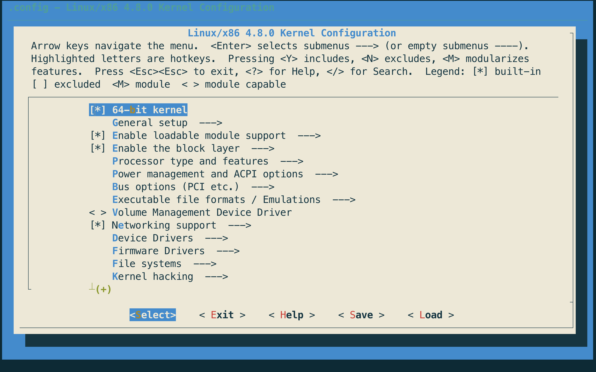
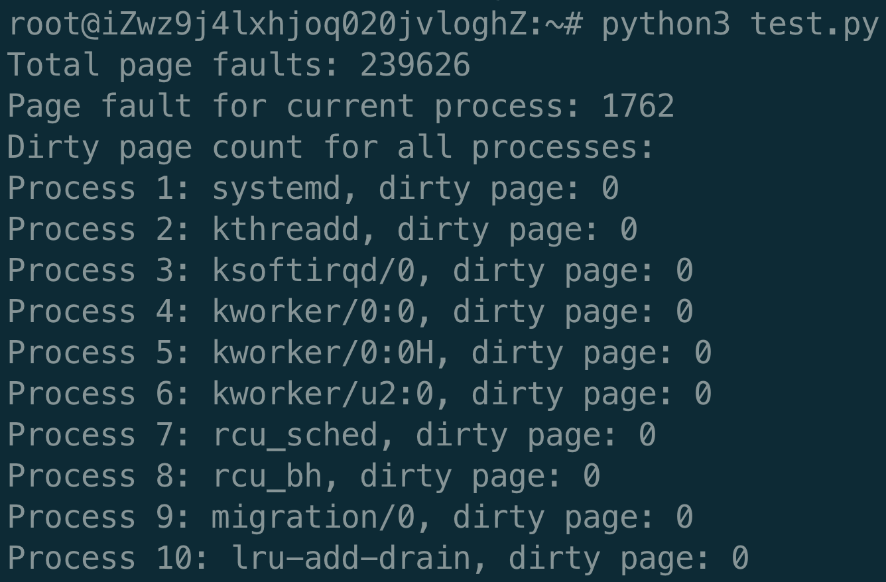

# OS实验：重建Linux内核并添加系统调用
> 这是一份懒人福利代码，按照以下教程操作就可以：）
> 有问题提个issue就行
### 前言
- 系统环境：Ubuntu 16.04.3 LTS (GNU/Linux 4.4.0-93-generic x86_64)
  - RAM: 2G
  - Memory: 40G
  - CPU: 1 core
- 目标内核：Linux-4.8
- 系统调用：创建333号调用，用于打印进程的错页数
### 如何操作
- 在操作前，最好将本目录下所有文件移到根目录‘～’
- 运行download.sh脚本：
  - `chmod +x download.sh`
  - `./download.sh`
- 运行overwrite.sh脚本：
  - `chmod +x overwrite.sh`
  - `./overwrite.sh`
- 进入linux-4.8目录，并创建编译配置：
  - `cd linux-4.8/`
  - `make menuconfig`
  - 进入图形界面之后，按两次esc直接退出即可
  - 
  - 回到根目录，准备下一步
- 运行make.sh脚本：
  - `chmod +x make.sh`
  - `./make.sh`
  - 然后，喝茶坐等编译完成🍵～
- 然后执行用户态脚本并查看结果：
  - `python3 test.py`
  - 如果结果如下图，那么恭喜你成功啦～
  - 
  - 不然的话，看一下下面⬇️
- 如果没有成功的话就比较麻烦：
  - 需要修改默认启动内核然后重启，再删掉原来的内核源码，然后从上面第一步重新开始做～
  - 表示曾经遇到过一次，然后改错启动内核导致根本启动不了～最后还是重装了整个系统，sigh
